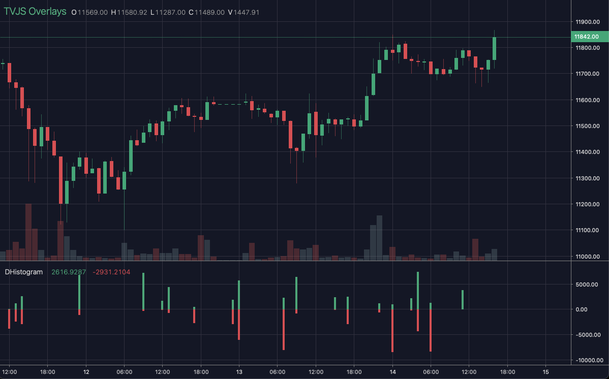

# DHistogram

<table><tr><td>
  
</td></tr></table>

## Info

| Author     | Type | Description                                            | Version |
| ---------- | ---- | ------------------------------------------------------ | ------- |
| Acid3croco | OV   | Double histogram allowing positive and negative values | 1.0.0   |


## Settings

| Name          | Description                      | Default |
| ------------- | -------------------------------- | ------- |
| lineWidth     | Line Width                       | 4       |
| thresholdSize | Minimum size to draw             | 0       |
| posColor      | Color first value (above base)   | #35a776 |
| negColor      | Color second value (bellow base) | #e54150 |

## How to use

```html
<template>
<trading-vue :overlays="overlays"></trading-vue>
</template>
<script>

import TradingVue from 'trading-vue-js'
import Overlays from 'tvjs-overlays'

export default {
    name: 'app',
    components: { TradingVue },
    data() {
        return {
            overlays: [Overlays['DHistogram']]
        }
    }
}

</script>

```

## Overlay data example

```js
[<time>, <positive>, <negative>]
```

```json
[
    [
        1593824400000,
        181.18076322654522,
        -994.0002514062256
    ],
    [
        1593828000000,
        3124.379157687875,
        -4559.454916174521
    ],
    [
        1593831600000,
        5797.114201893417,
        -3676.7492859752233
    ],
    [
        1593835200000,
        1596.0565186407564,
        -5565.684345613291
    ],
    [
        1593838800000,
        6434.787186815634,
        -765.7357371225255
    ],
    [
        1593842400000,
        115.99284301686053,
        -9232.86442889146
    ],
    [
        1593849600000,
        4595.951337615286,
        -5688.770813565728
    ],
    [
        1593860400000,
        140.93300253190952,
        -2842.649521671192
    ],
    [
        1593864000000,
        1532.3090155749353,
        -4083.637059297083
    ],
    [
        1593892800000,
        4224.260600976558,
        -18.415991607837444
    ]
]
```

## Read more about DHistogram

[Investopedia: DHistogram](https://www.investopedia.com/search?q=DHistogram)<br>
[Investopedia: Histogram plot](https://www.investopedia.com/search?q=Histogram%20plot)
