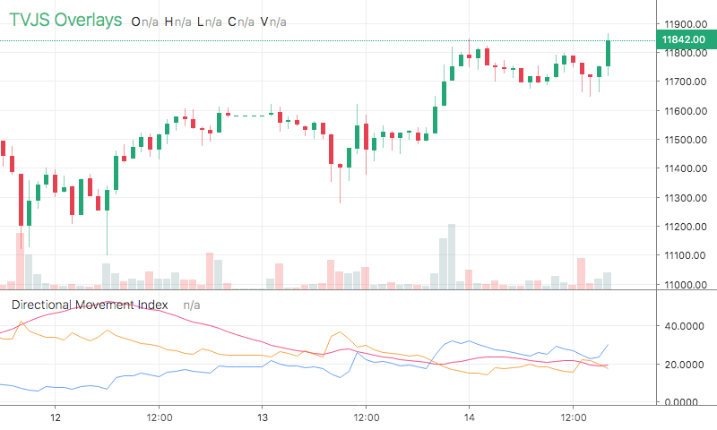

# DMI

<table><tr><td>
  
</td></tr></table>

## Info

| Author | Type | Description | Version |
| ------ | ---- | ----------- | ------- |
| StdSquad | OV+Script | Directional Movement Index | 1.0.0 |


## Settings

| Name | Description | Default |
| ---- | ----------- | ------- |
| length | DI Length | 15 |
| smooth | ADX Smothing | 15 |
| lineWidth | Line Width |  |
| lineWidths | Line Widths |  |
| colors | Colors |  |

## How to use

```html
<template>
<trading-vue :overlays="overlays"></trading-vue>
</template>
<script>

import TradingVue from 'trading-vue-js'
import Overlays from 'tvjs-overlays'

export default {
    name: 'app',
    components: { TradingVue },
    data() {
        return {
            overlays: [Overlays['DMI']]
        }
    }
}

</script>

```

## Overlay data example

```json
[]
```

## Read more about DMI

[Investopedia: DMI](https://www.investopedia.com/search?q=DMI)<br>
[Investopedia: Directional Movement Index](https://www.investopedia.com/search?q=Directional%20Movement%20Index)

