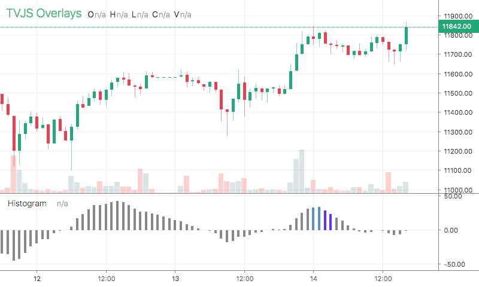

# Histogram

<table><tr><td>
  
</td></tr></table>

## Info

| Author | Type | Description | Version |
| ------ | ---- | ----------- | ------- |
| StdSquad | OV | Histogram plot | 1.0.0 |


## Settings

| Name | Description | Default |
| ---- | ----------- | ------- |
| lineWidth | Line Width |  |
| color | Color |  |

## How to use

```html
<template>
<trading-vue :overlays="overlays"></trading-vue>
</template>
<script>

import TradingVue from 'trading-vue-js'
import Overlays from 'tvjs-overlays'

export default {
    name: 'app',
    components: { TradingVue },
    data() {
        return {
            overlays: [Overlays['Histogram']]
        }
    }
}

</script>

```

## Overlay data example

```json
[
    [
        1593943200000,
        -17.62391648491919
    ],
    [
        1593946800000,
        -16.107002492113516
    ],
    [
        1593950400000,
        -13.981164138139736
    ],
    [
        1593954000000,
        -13.571953383030966
    ],
    [
        1593957600000,
        -11.618028698605752
    ],
    [
        1593961200000,
        -10.029063349748533
    ],
    [
        1593964800000,
        -8.046436364324933
    ],
    [
        1593968400000,
        -6.4351584666356985
    ],
    [
        1593972000000,
        -4.463494190161235
    ],
    [
        1593975600000,
        -3.312823436198885
    ]
]
```

## Read more about Histogram

[Investopedia: Histogram](https://www.investopedia.com/search?q=Histogram)<br>
[Investopedia: Histogram plot](https://www.investopedia.com/search?q=Histogram%20plot)

