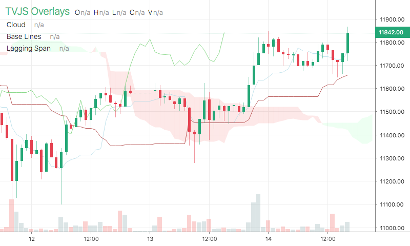

# Ichi

<table><tr><td>
  
</td></tr></table>

## Info

| Author | Type | Description | Version |
| ------ | ---- | ----------- | ------- |
| C451 | OV+Script | Ichimoku Cloud based on scripts | 1.0.0 |


## Settings

| Name | Description | Default |
| ---- | ----------- | ------- |
| CP | Conversion Line Length | 9 |
| BP | Base Line Length | 26 |
| LSP | Lagging Span 2 Length | 52 |
| DIZ | Displacement | 26 |
| baseColor | Base Line Color | brown |
| conversionColor | Conversion Line Color | lightblue |
| laggingColor | Lagging Span Color | #66CC66 |
| lineWidth | Line Width |  |
| color1 | Color1 |  |
| color2 | Color2 |  |
| back1 | Back1 |  |
| back2 | Back2 |  |
| drawLines | Draw Lines |  |

## How to use

```html
<template>
<trading-vue :overlays="overlays"></trading-vue>
</template>
<script>

import TradingVue from 'trading-vue-js'
import Overlays from 'tvjs-overlays'

export default {
    name: 'app',
    components: { TradingVue },
    data() {
        return {
            overlays: [Overlays['Ichi']]
        }
    }
}

</script>

```

## Overlay data example

```json
[]
```

## Read more about Ichi

[Investopedia: Ichi](https://www.investopedia.com/search?q=Ichi)<br>
[Investopedia: Ichimoku Cloud based on scripts](https://www.investopedia.com/search?q=Ichimoku%20Cloud%20based%20on%20scripts)

