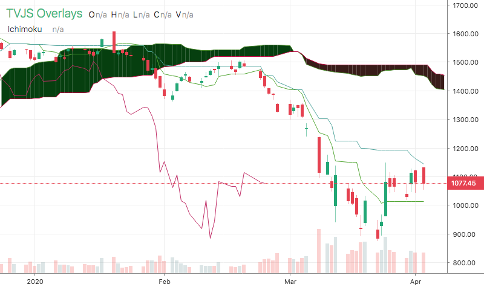

# Ichimoku

<table><tr><td>
  
</td></tr></table>

## Info

| Author | Type | Description | Version |
| ------ | ---- | ----------- | ------- |
| Sudeep Batra | OV |  | 1.0.0 |


## Settings

| Name | Description | Default |
| ---- | ----------- | ------- |
| tenkan-color | Tenkan Color |  |
| kijun-color | Kijun Color |  |
| senkou_spanA_color | Senkou Span A Color |  |
| senkou_spanB_color | Senkou Span B Color |  |
| chinkou_color | Chinkou Color |  |
| kumo_up_color | Kumo Up Color |  |
| kumo_down_color | Kumo Down Color |  |
| tenkan_line_width | Tenkan Line Width |  |
| kijun_line_width | Kijun Line Width |  |
| senkou_spanA_line_width | Senkou Span A Line Width |  |
| senkou_spanB_line_width | Senkou Span B Line Width |  |
| chinkou_line_width | Chinkou Line Width |  |

## How to use

```html
<template>
<trading-vue :overlays="overlays"></trading-vue>
</template>
<script>

import TradingVue from 'trading-vue-js'
import Overlays from 'tvjs-overlays'

export default {
    name: 'app',
    components: { TradingVue },
    data() {
        return {
            overlays: [Overlays['Ichimoku']]
        }
    }
}

</script>

```

## Overlay data example

```json
[
    [
        1534204800000,
        1198.825,
        1115.85,
        986.275,
        971.3,
        1230.6
    ],
    [
        1534377600000,
        1200.625,
        1124.775,
        992.7750000000001,
        973.75,
        1251.4
    ],
    [
        1534464000000,
        1203.525,
        1137.15,
        1023.825,
        1002.8,
        1253.75
    ],
    [
        1534723200000,
        1206.9,
        1153.1999999999998,
        1029.225,
        1007.8,
        1257.95
    ],
    [
        1534809600000,
        1217.1,
        1160.55,
        1029.225,
        1007.8,
        1231.7
    ],
    [
        1534982400000,
        1228.35,
        1171.8,
        1029.225,
        1007.8,
        1205.1
    ],
    [
        1535068800000,
        1231.325,
        1178.625,
        1030.7,
        1007.8,
        1122.25
    ],
    [
        1535328000000,
        1239.275,
        1191.1,
        1038.45,
        1010.8,
        1048.85
    ],
    [
        1535414400000,
        1253.65,
        1213.6,
        1054.325,
        1022.55,
        1109.4
    ],
    [
        1535500800000,
        1262.25,
        1216.6,
        1058.7875,
        1022.55,
        1090.05
    ]
]
```

## Read more about Ichimoku

[Investopedia: Ichimoku](https://www.investopedia.com/search?q=Ichimoku)<br>
[Investopedia: ](https://www.investopedia.com/search?q=)

