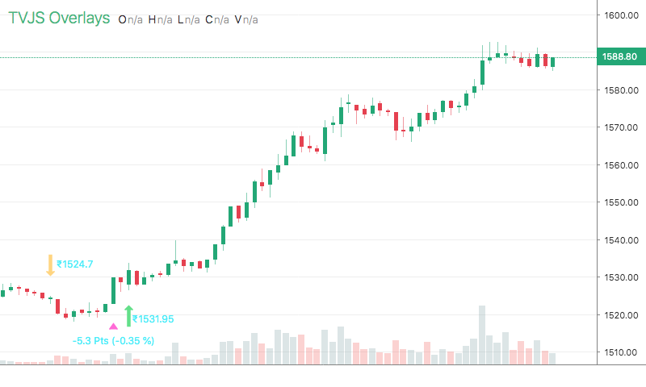

# LongShortTrades

<table><tr><td>
  
</td></tr></table>

## Info

| Author | Type | Description | Version |
| ------ | ---- | ----------- | ------- |
| Sudeep Batra | OV |  | 1.0.1 |


## Settings

| Name | Description | Default |
| ---- | ----------- | ------- |
| currency | Currency |  |
| longColor | Long Color |  |
| shortColor | Short Color |  |
| longCoverColor | Long Cover Color |  |
| shortCoverColor | Short Cover Color |  |
| markerSize | Marker Size |  |
| showLabel | Show Label |  |
| font | Font |  |

## How to use

```html
<template>
<trading-vue :overlays="overlays"></trading-vue>
</template>
<script>

import TradingVue from 'trading-vue-js'
import Overlays from 'tvjs-overlays'

export default {
    name: 'app',
    components: { TradingVue },
    data() {
        return {
            overlays: [Overlays['LongShortTrades']]
        }
    }
}

</script>

```

## Overlay data example

```json
[
    [
        1591004879000,
        1,
        "",
        "",
        1486.95,
        1494,
        1486.8,
        1491.65
    ],
    [
        1591018739000,
        3,
        "30.4 Pts",
        "2.04 %",
        1528.45,
        1528.5,
        1521.3,
        1522.05
    ],
    [
        1591022877000,
        0,
        "",
        "",
        1522.4,
        1523.1,
        1520.1,
        1521.05
    ],
    [
        1591023779000,
        2,
        "-1.3 Pts",
        "-0.09 %",
        1517.8,
        1523.2,
        1516,
        1522.35
    ],
    [
        1591089479000,
        1,
        "",
        "",
        1525,
        1533.55,
        1522.85,
        1526.55
    ],
    [
        1591093259000,
        3,
        "-0.55 Pts",
        "-0.04 %",
        1528.4,
        1530.5,
        1526,
        1526
    ],
    [
        1591101179000,
        0,
        "",
        "",
        1526.8,
        1528.9,
        1526.8,
        1527
    ],
    [
        1591101538000,
        2,
        "-1.1 Pts",
        "-0.07 %",
        1527.8,
        1528.95,
        1527.45,
        1528.1
    ],
    [
        1591106579000,
        1,
        "",
        "",
        1534.4,
        1537,
        1534,
        1535.3
    ],
    [
        1591178579000,
        3,
        "5.5 Pts",
        "0.36 %",
        1542.8,
        1543.6,
        1540.8,
        1540.8
    ]
]
```

## Read more about LongShortTrades

[Investopedia: LongShortTrades](https://www.investopedia.com/search?q=LongShortTrades)<br>
[Investopedia: ](https://www.investopedia.com/search?q=)

