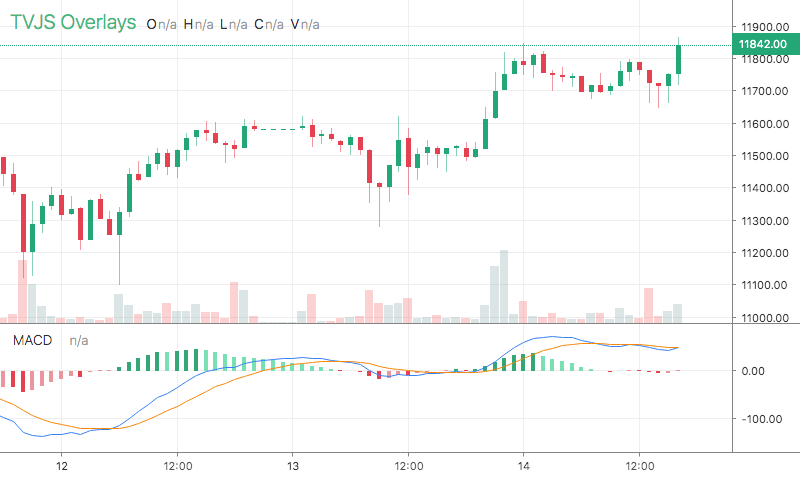

# MACD

<table><tr><td>
  
</td></tr></table>

## Info

| Author | Type | Description | Version |
| ------ | ---- | ----------- | ------- |
| StdSquad | OV+Script | Moving Average Convergence/Divergence | 1.0.1 |


## Settings

| Name | Description | Default |
| ---- | ----------- | ------- |
| fast | Fast Length | 12 |
| slow | Slow Length | 26 |
| smooth | Signal EMA | 9 |
| histColors | Colors |  |
| histWidth | Hist Width |  |
| macdWidth | Macd Width |  |
| signalWidth | Signal Width |  |
| defColor | Def Color |  |
| macdColor | Macd Color |  |
| signalColor | Signal Color |  |
| histColors | Hist Colors |  |

## How to use

```html
<template>
<trading-vue :overlays="overlays"></trading-vue>
</template>
<script>

import TradingVue from 'trading-vue-js'
import Overlays from 'tvjs-overlays'

export default {
    name: 'app',
    components: { TradingVue },
    data() {
        return {
            overlays: [Overlays['MACD']]
        }
    }
}

</script>

```

## Overlay data example

```json
[]
```

## Read more about MACD

[Investopedia: MACD](https://www.investopedia.com/search?q=MACD)<br>
[Investopedia: Moving Average Convergence/Divergence](https://www.investopedia.com/search?q=Moving%20Average%20Convergence/Divergence)

