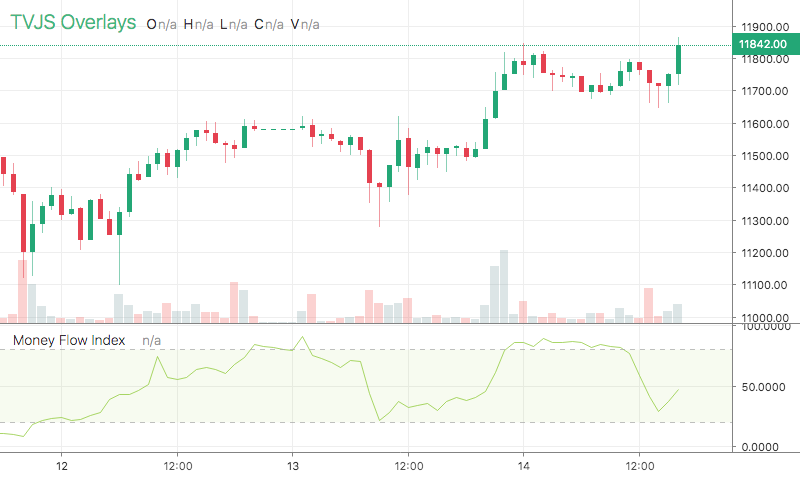

# MFI

<table><tr><td>
  
</td></tr></table>

## Info

| Author | Type | Description | Version |
| ------ | ---- | ----------- | ------- |
| StdSquad | OV+Script | Money Flow Index | 1.0.0 |


## Settings

| Name | Description | Default |
| ---- | ----------- | ------- |
| length | Length | 14 |
| upper | Upper |  |
| lower | Lower |  |
| upper | Upper |  |
| lower | Lower |  |
| lineWidth | Line Width |  |
| color | Color |  |
| bandColor | Band Color |  |
| backColor | Back Color |  |

## How to use

```html
<template>
<trading-vue :overlays="overlays"></trading-vue>
</template>
<script>

import TradingVue from 'trading-vue-js'
import Overlays from 'tvjs-overlays'

export default {
    name: 'app',
    components: { TradingVue },
    data() {
        return {
            overlays: [Overlays['MFI']]
        }
    }
}

</script>

```

## Overlay data example

```json
[]
```

## Read more about MFI

[Investopedia: MFI](https://www.investopedia.com/search?q=MFI)<br>
[Investopedia: Money Flow Index](https://www.investopedia.com/search?q=Money%20Flow%20Index)

