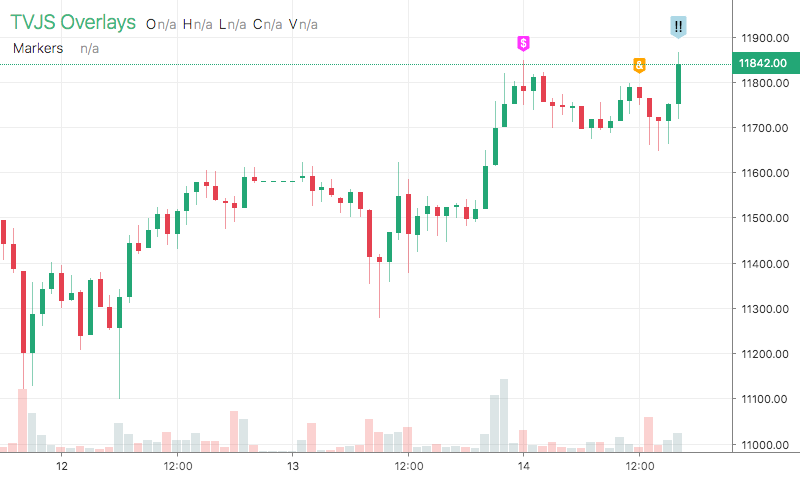

# Markers

<table><tr><td>
  
</td></tr></table>

## Info

| Author | Type | Description | Version |
| ------ | ---- | ----------- | ------- |
| C451 | OV | Interactive markers | 1.0.1 |


## Settings

| Name | Description | Default |
| ---- | ----------- | ------- |
| font | Font |  |

## How to use

```html
<template>
<trading-vue :overlays="overlays"></trading-vue>
</template>
<script>

import TradingVue from 'trading-vue-js'
import Overlays from 'tvjs-overlays'

export default {
    name: 'app',
    components: { TradingVue },
    data() {
        return {
            overlays: [Overlays['Markers']]
        }
    }
}

</script>

```

## Overlay data example

```json
[
    [
        1597363200000,
        {
            "color": "#FF33FF",
            "sel": false,
            "$": 11860
        }
    ],
    [
        1597406400000,
        {
            "sel": false,
            "$": 11811,
            "text": "&"
        }
    ],
    [
        1597420800000,
        {
            "color": "lightblue",
            "sel": true,
            "$": 11889,
            "text": "!!",
            "textColor": "black"
        }
    ]
]
```

## Read more about Markers

[Investopedia: Markers](https://www.investopedia.com/search?q=Markers)<br>
[Investopedia: Interactive markers](https://www.investopedia.com/search?q=Interactive%20markers)

