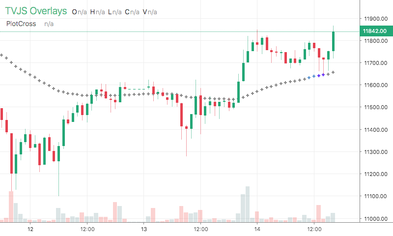

# PlotCross

<table><tr><td>
  
</td></tr></table>

## Info

| Author | Type | Description | Version |
| ------ | ---- | ----------- | ------- |
| StdSquad | OV | Plot line with crosses | 1.0.0 |


## Settings

| Name | Description | Default |
| ---- | ----------- | ------- |
| lineWidth | Line Width |  |
| color | Color |  |

## How to use

```html
<template>
<trading-vue :overlays="overlays"></trading-vue>
</template>
<script>

import TradingVue from 'trading-vue-js'
import Overlays from 'tvjs-overlays'

export default {
    name: 'app',
    components: { TradingVue },
    data() {
        return {
            overlays: [Overlays['PlotCross']]
        }
    }
}

</script>

```

## Overlay data example

```json
[
    [
        1593824400000,
        9078.08979168
    ],
    [
        1593828000000,
        9078.752937104315
    ],
    [
        1593831600000,
        9079.350861139439
    ],
    [
        1593835200000,
        9079.944945016325
    ],
    [
        1593838800000,
        9080.633378545097
    ],
    [
        1593842400000,
        9080.890367040583
    ],
    [
        1593846000000,
        9080.969176176246
    ],
    [
        1593849600000,
        9081.284110443845
    ],
    [
        1593853200000,
        9081.327870818595
    ],
    [
        1593856800000,
        9081.001287649238
    ]
]
```

## Read more about PlotCross

[Investopedia: PlotCross](https://www.investopedia.com/search?q=PlotCross)<br>
[Investopedia: Plot line with crosses](https://www.investopedia.com/search?q=Plot%20line%20with%20crosses)

