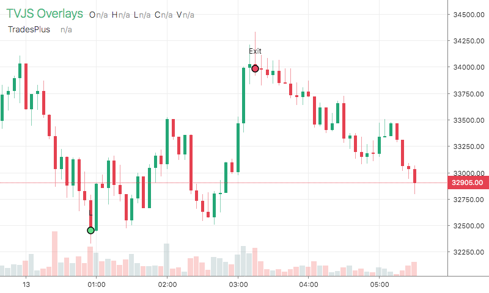

# TradesPlus

<table><tr><td>
  
</td></tr></table>

## Info

| Author | Type | Description | Version |
| ------ | ---- | ----------- | ------- |
| C451 | OV | Trades overlay with stops | 1.0.1 |


## Settings

| Name | Description | Default |
| ---- | ----------- | ------- |
| buyColor | Buy Color |  |
| sellColor | Sell Color |  |
| labelColor | Label Color |  |
| markerSize | Marker Size |  |
| showLabel | Show Label |  |
| font | Font |  |

## How to use

```html
<template>
<trading-vue :overlays="overlays"></trading-vue>
</template>
<script>

import TradingVue from 'trading-vue-js'
import Overlays from 'tvjs-overlays'

export default {
    name: 'app',
    components: { TradingVue },
    data() {
        return {
            overlays: [Overlays['TradesPlus']]
        }
    }
}

</script>

```

## Overlay data example

```json
[
    [
        1610045100000,
        1,
        37491.5,
        "L"
    ],
    [
        1610073600000,
        0,
        36741.67,
        "Stop"
    ],
    [
        1610274600000,
        1,
        40145,
        "L"
    ],
    [
        1610277600000,
        0,
        39342.1,
        "Stop"
    ],
    [
        1610298900000,
        1,
        38844,
        "L"
    ],
    [
        1610299200000,
        0,
        38067.12,
        "Stop"
    ],
    [
        1610310000000,
        1,
        36505,
        "L"
    ],
    [
        1610310300000,
        0,
        35774.9,
        "Stop"
    ],
    [
        1610335200000,
        1,
        35757,
        "L"
    ],
    [
        1610335500000,
        0,
        35041.86,
        "Stop"
    ]
]
```

## Read more about TradesPlus

[Investopedia: TradesPlus](https://www.investopedia.com/search?q=TradesPlus)<br>
[Investopedia: Trades overlay with stops](https://www.investopedia.com/search?q=Trades%20overlay%20with%20stops)

