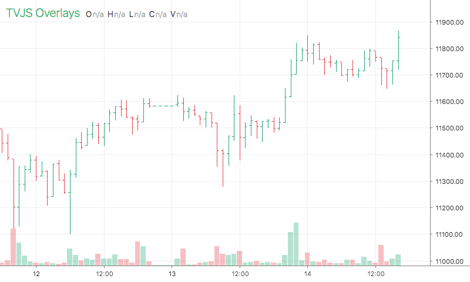

# XOhlcBars

<table><tr><td>
  
</td></tr></table>

## Info

| Author | Type | Description | Version |
| ------ | ---- | ----------- | ------- |
| X | OV | Bar Chart | 1.3.0 |


## Settings

| Name | Description | Default |
| ---- | ----------- | ------- |
| showVolume | Show Volume |  |
| priceLine | Price Line |  |
| upBarColor | Up Bar Color |  |
| downBarColor | Down Bar Color |  |
| barWidth | Bar Width |  |
| upBarColor | Up Bar Color |  |
| downBarColor | Down Bar Color |  |
| barWidth | Bar Width |  |
| hlcOnly | Hlc Only |  |
| lineWidth | Line Width |  |

## How to use

```html
<template>
<trading-vue :overlays="overlays"></trading-vue>
</template>
<script>

import TradingVue from 'trading-vue-js'
import Overlays from 'tvjs-overlays'

export default {
    name: 'app',
    components: { TradingVue },
    data() {
        return {
            overlays: [Overlays['XOhlcBars']]
        }
    }
}

</script>

```

## Overlay data example

```json
[
    [
        1593824400000,
        9082.6,
        9082.7,
        9069,
        9078.08979168,
        32.34898355
    ],
    [
        1593828000000,
        9078.1,
        9096.4,
        9077.2,
        9095,
        16.90563646
    ],
    [
        1593831600000,
        9094.92662953,
        9104,
        9093.9,
        9094,
        5.8078496
    ],
    [
        1593835200000,
        9094,
        9096,
        9085.7,
        9094.5,
        21.54421819
    ],
    [
        1593838800000,
        9094.6,
        9098.3,
        9090.4,
        9097.5,
        7.1796787
    ],
    [
        1593842400000,
        9097.5,
        9098.5,
        9086.9,
        9087.18658518,
        9.3608155
    ],
    [
        1593846000000,
        9087.18658518,
        9092.1,
        9082.9,
        9082.9,
        6.1172331
    ],
    [
        1593849600000,
        9082.92514237,
        9093.1,
        9082.9,
        9089,
        32.97447961
    ],
    [
        1593853200000,
        9089.1,
        9089.1,
        9082.4,
        9082.4,
        7.25196926
    ],
    [
        1593856800000,
        9082.6,
        9082.6,
        9072,
        9073,
        25.63248584
    ]
]
```

## Read more about XOhlcBars

[Investopedia: XOhlcBars](https://www.investopedia.com/search?q=XOhlcBars)<br>
[Investopedia: Bar Chart](https://www.investopedia.com/search?q=Bar%20Chart)

